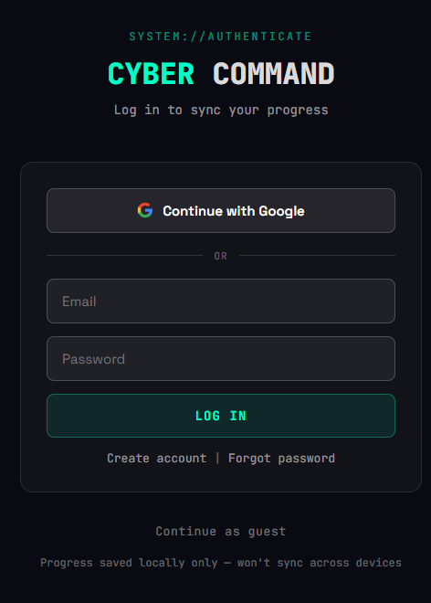
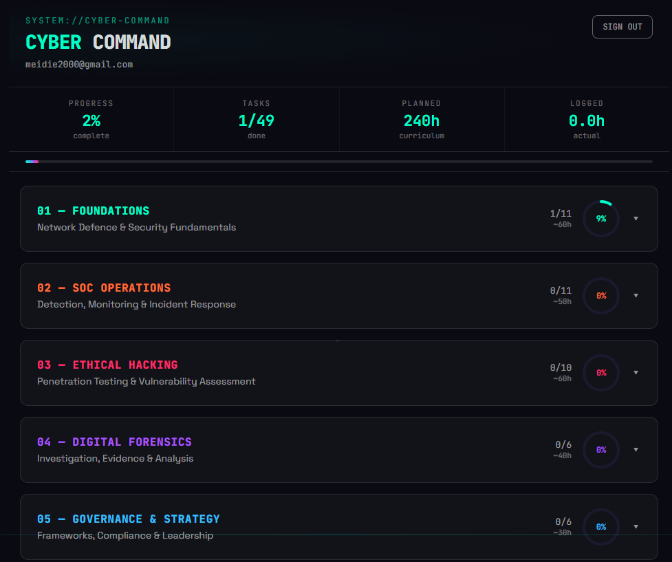
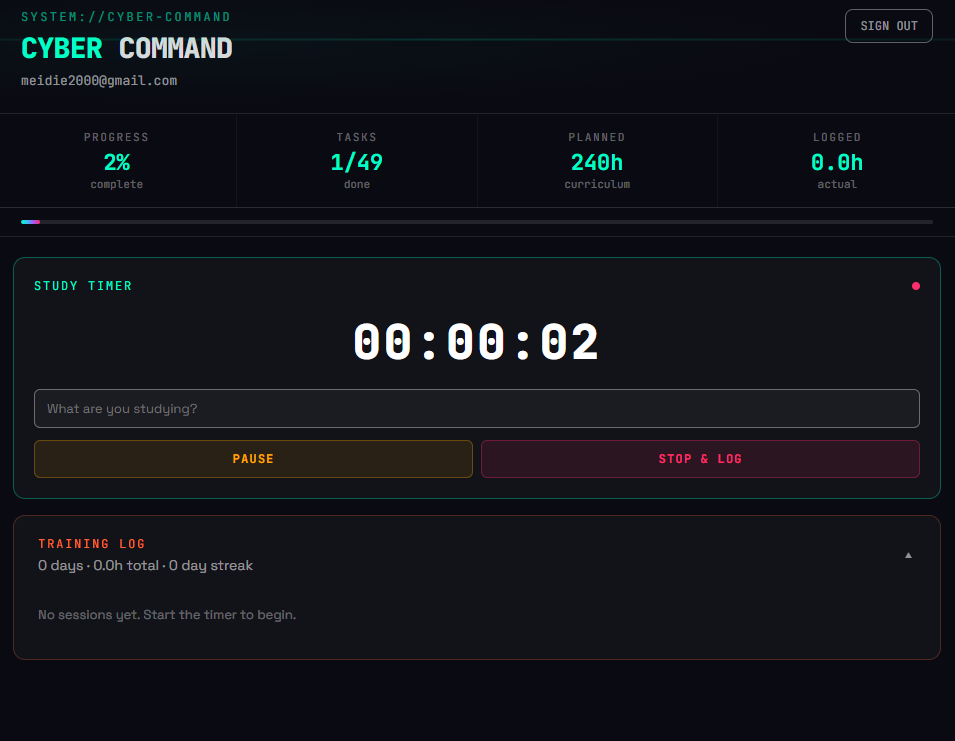
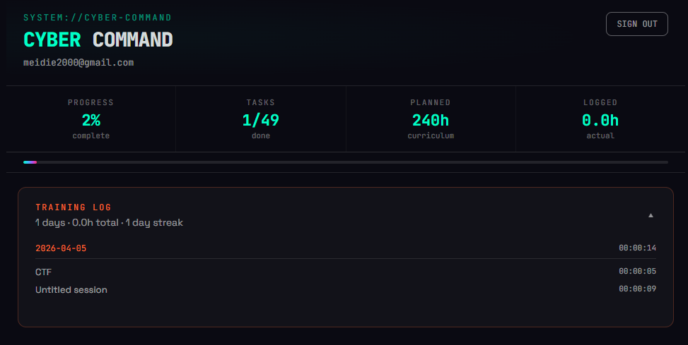

# Cyber Command Center

A self-directed cybersecurity training platform with progress tracking, study timer, and notes. Works instantly as a guest — no setup required.

**[Live Demo](https://c3.mdpstudio.com.au)** — try it now, no account needed.

## Screenshots

### Login & Guest Access
Google OAuth, email/password, or skip straight to guest mode. Guest progress saves to your browser automatically.



### Dashboard
Track 49 tasks across 6 phases (240+ hours). Stats update in real-time — progress percentage, tasks completed, planned hours, and logged study time.



### Study Timer
Start/pause/stop timer with session labels. Completed sessions log to your training history with daily breakdowns, cumulative hours, and streak tracking.



### Training Log
Daily breakdown of study sessions with dates, labels, durations, and streak counter.



## Quick Start

### Option A: Just use it (no setup)

Visit the **[live demo](https://c3.mdpstudio.com.au)** — guest mode works instantly with localStorage persistence.

### Option B: Self-host with Supabase (synced accounts)

1. Create a free project at [supabase.com](https://supabase.com)
2. Run `supabase/schema.sql` in the SQL Editor
3. Copy your Project URL and `anon` key from Settings > API

```bash
cp .env.example .env    # paste your Supabase credentials
npm install
npm run dev
```

### Deploy

**Netlify** (recommended) — connect your GitHub repo. The included `netlify.toml` handles everything. Set `VITE_SUPABASE_URL` and `VITE_SUPABASE_ANON_KEY` in Site Settings > Environment Variables.

**Docker:**
```bash
docker build -t cyber-command .
docker run -p 3000:3000 cyber-command
```

## Features

- **Zero-friction guest mode** — works without any backend; progress saved to localStorage
- **Google OAuth + email auth** — sign up, log in, password reset
- **6-phase curriculum** — 240+ hours of structured cybersecurity training
- **Real-time progress tracking** — synced across devices (or local-only in guest mode)
- **Study timer** — start/pause/stop with labeled session logging
- **Training log** — daily breakdown, streak counter, cumulative hours
- **Per-task notes** — paste commands, flags, findings inline
- **Row Level Security** — each user can only access their own data

### Curriculum

| Phase | Focus | Hours |
|-------|-------|-------|
| 01 — Foundations | Networking, Linux, Cryptography | ~60h |
| 02 — SOC Operations | SIEM, Detection, Incident Response | ~50h |
| 03 — Ethical Hacking | VAPT, Metasploit, CTF Prep | ~60h |
| 04 — Digital Forensics | Memory, Disk, Network Analysis | ~40h |
| 05 — Governance & Strategy | Frameworks, Compliance, Risk | ~30h |
| 06 — Certification Track | Security+, CySA+, OSCP | — |

Curated links to 9 free platforms: TryHackMe, HackTheBox, PicoCTF, OverTheWire, CyberDefenders, Blue Team Labs, CTFtime, VulnHub, and MITRE ATT&CK.

## Tech Stack

- **Frontend:** React 18, Vite 5, custom dark terminal aesthetic (no CSS framework)
- **Backend:** Supabase (PostgreSQL + Auth + RLS) — optional, app works without it
- **Deployment:** Netlify with security headers, Docker support

## Architecture

```
┌─────────────────────────────────────────┐
│           React Frontend (Vite)         │
│  ┌──────────┐ ┌───────┐ ┌───────────┐  │
│  │ Dashboard │ │ Timer │ │ Auth/Guest│  │
│  └──────────┘ └───────┘ └───────────┘  │
├─────────────────────────────────────────┤
│  Supabase configured?                  │
│  ├─ Yes → Supabase SDK (sync + auth)  │
│  └─ No  → localStorage (guest mode)   │
└─────────────────────────────────────────┘
```

## Security

Production headers via `netlify.toml`:
- `X-Frame-Options: DENY`
- `X-Content-Type-Options: nosniff`
- `Referrer-Policy: strict-origin-when-cross-origin`
- `Permissions-Policy: camera=(), microphone=(), geolocation=()`

[Privacy Policy](https://c3.mdpstudio.com.au/privacy) | [Terms of Service](https://c3.mdpstudio.com.au/terms)
